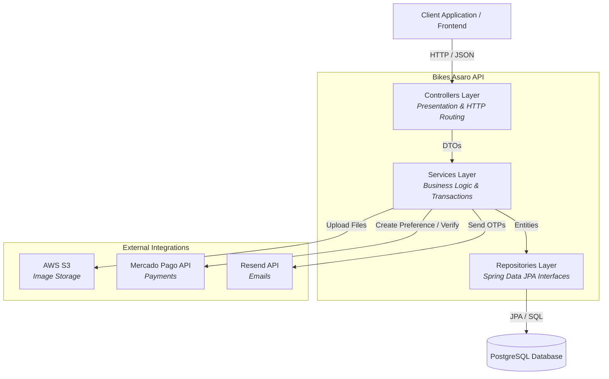
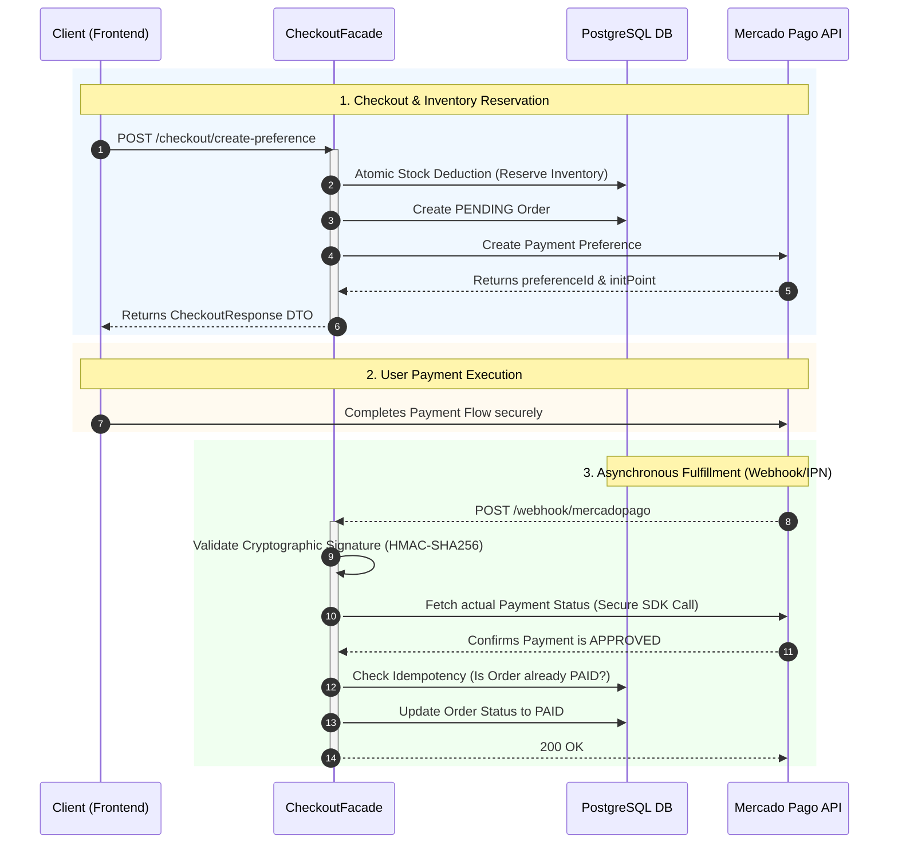

<div align="center">
  
  # 🚴‍♂️ Bikes Asaro API
  
  **A robust, production-ready RESTful backend powering a modern bicycle e-commerce platform.**
  
  [](https://openjdk.org/)
  [](https://spring.io/projects/spring-boot)
  [](https://www.postgresql.org/)
  <br>
  [](https://aws.amazon.com/s3/)
  [](https://www.mercadopago.com/)
  [](https://jwt.io)
  [](https://swagger.io/)

  *Clean Code Architecture • Domain-Driven Design • Secure Integrations*

</div>

---

## 📖 Table of Contents
- [✨ Features](#-features)
- [🏗️ Architecture & Best Practices](#-architecture--best-practices)
- [🛒 Order & Payment Flow](#-order--payment-flow)
- [📂 Project Structure](#-project-structure)
- [🚀 Getting Started](#-getting-started)
- [📚 API Documentation](#-api-documentation)
- [🔮 Future Roadmap](#-future-roadmap)
- [👨‍💻 Author](#-author)

---

## ✨ Features

* **Advanced Security & Authentication:** * Stateless JWT authentication with Role-Based Access Control (`ADMIN` vs `CUSTOMER`).
  * Social Login via Google OAuth2.
  * Account lifecycle management: Email verification, deactivation, and secure password reset.
  * **Cryptographically Secured Webhooks:** HMAC-SHA256 signature validation to prevent DoS attacks and payload spoofing.
* **Catalog & Inventory:** * Searchable, filterable, and paginated product catalog.
  * Secure, direct image uploads to AWS S3 with strict 5MB payload limits.
* **Smart Checkout & Inventory Protection:** * Real-time shopping cart validation and dynamic shipping cost calculations.
  * **Proactive Inventory Reservation:** Stock is atomically locked the moment a checkout is initialized to prevent race conditions and overselling.
  * **Automated Abandoned Cart Recovery:** Background Cron Jobs (`@Scheduled`) automatically release reserved inventory if a user fails to pay within the allotted timeframe.

---

## 🏗️ Architecture & Best Practices

This project is built with enterprise-grade standards to ensure maintainability, scalability, and strict separation of concerns using a **Layered Architecture**.



### Architectural Highlights:
* **Immutability via Records:** Extensive use of Java 16+ `record` classes for all Data Transfer Objects (DTOs), guaranteeing thread safety and eliminating boilerplate.
* **Strict DTO Pattern:** Complete decoupling of JPA Entities and API Responses. Sensitive data never leaks to the client.
* **Generic Pagination Wrapper (`PageResponse<T>`):** Spring Data's native `Page` objects are intentionally hidden. A static factory method safely maps them to a clean, standardized pagination metadata object.
* **Global Exception Handling:** A centralized `@RestControllerAdvice` captures errors and returns a standardized JSON `ErrorResponse`.
* **Meta-Annotations for Swagger:** Complex OpenAPI configurations are abstracted into custom annotations (`@ApiAdminErrors`, `@ApiPublicErrors`, `@ApiNotFound`), keeping controllers clean.
* **Facade Pattern & Transaction Boundaries:** Complex external workflows (like Checkout) use Orchestrator Facades to strictly separate internal database transactions (`@Transactional`) from slow external network calls (Mercado Pago SDK), protecting the database connection pool under heavy load.

---

## 🛒 Order & Payment Flow

This API integrates deeply with **Mercado Pago** to ensure secure, asynchronous payment processing and reliable inventory management.



---

## 📂 Project Structure

```text
src/main/java/com/bikestore/api/
├── annotation/     # Custom Swagger meta-annotations
├── config/         # Security, CORS, AWS S3, Mercado Pago, Swagger setup
├── controller/     # REST API endpoints grouped by domain
├── dto/            # Immutable Request/Response records and wrappers
├── entity/         # JPA Domain models (User, Product, Order)
├── exception/      # Custom exceptions and GlobalExceptionHandler
├── mapper/         # Layer transformations (Entity <-> DTO)
├── repository/     # Spring Data JPA interfaces
├── security/       # JWT Filters and Authentication providers
└── service/        # Core business logic and external API integrations
```

---

## 🚀 Getting Started

### Prerequisites
* **Java 21** or higher.
* **PostgreSQL** running locally or via Docker.
* Developer accounts for AWS (S3), Mercado Pago, and Resend.

### 1. Clone the repository
```bash
git clone [https://github.com/salompablo/bikestore-api.git](https://github.com/salompablo/bikestore-api.git)
cd bikestore-api/api
```

### 2. Environment Variables
Create a `.env` or `application-dev.properties` file in the root directory:

```env
# Database
DB_URL=jdbc:postgresql://localhost:5432/bikestore
DB_USERNAME=postgres
DB_PASSWORD=your_password

# Security
JWT_SECRET=your_super_secret_256_bit_jwt_key
GOOGLE_CLIENT_ID=your_google_oauth_client_id

# Mercado Pago
MP_ACCESS_TOKEN=your_mercado_pago_access_token
MP_WEBHOOK_SECRET=your_mercado_pago_webhook_signature_secret
MP_NOTIFICATION_URL=https://your-domain.com/api/v1/webhook/mercadopago

# AWS S3 (Media Storage)
AWS_REGION=sa-east-1
AWS_BUCKET_NAME=your_bucket_name
AWS_ACCESS_KEY_ID=your_aws_access_key
AWS_SECRET_ACCESS_KEY=your_aws_secret_key

# Resend (Transactional Emails)
RESEND_API_KEY=your_resend_api_key
```

### 3. Build & Run
Using the included Maven wrapper:
```bash
./mvnw clean install
./mvnw spring-boot:run
```
The server will start at `http://localhost:8080`.

---

## 📚 API Documentation

This API is fully documented using OpenAPI 3. Once the application is running, you can explore endpoints, view schemas, and execute test requests via the Swagger UI:

👉 **[http://localhost:8080/swagger-ui/index.html](http://localhost:8080/swagger-ui/index.html)**

---

## 🔮 Future Roadmap

- [ ] **Unit & Integration Testing:** Implement robust test coverage using JUnit 5, Mockito, and Testcontainers.
- [ ] **Caching Layer:** Integrate Redis to cache the product catalog and categories, reducing database load.
- [ ] **Rate Limiting:** Protect public endpoints (like login and registration) against brute-force attacks using Bucket4j.
- [ ] **Database Migrations:** Integrate Flyway or Liquibase for versioned database schema management.

---

## 👨‍💻 Author

**Pablo Salom Pita** | Full-Stack Developer

[](https://www.linkedin.com/in/pablo-salom/)
[](https://github.com/salompablo)
