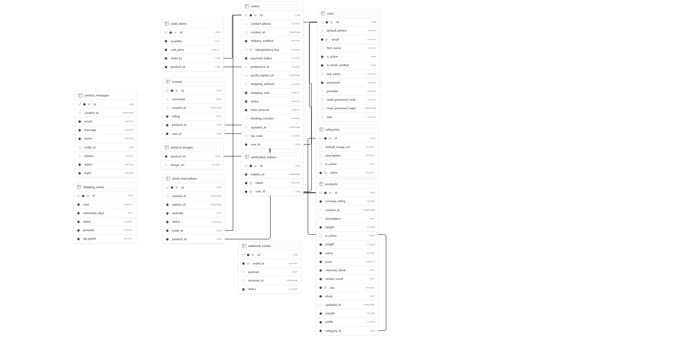

# Bikes Asaro API

[](https://openjdk.org/)
[](https://spring.io/projects/spring-boot)
[](https://www.postgresql.org/)
[](https://aws.amazon.com/s3/)
[](https://www.mercadopago.com/)

Backend API for **Bikes Asaro**, a bicycle e-commerce platform. The service is built with **Java 21**, **Spring Boot**, and **PostgreSQL**, and it integrates catalog management, checkout orchestration, shipping workflows, payments, notifications, and customer account management in a single backend.

This backend works together with the Angular frontend available at **[Salompablo/bikes-asaro-front](https://github.com/Salompablo/bikes-asaro-front)**. The platform is also designed to be deployed under the **bikesasaro.com.ar** domain.

## Table of Contents

- [Project Overview & Tech Stack](#project-overview--tech-stack)
- [Architecture & Design Patterns](#architecture--design-patterns)
- [Core Features](#core-features)
- [Payment Integration (Mercado Pago)](#payment-integration-mercado-pago)
- [Database Schema](#database-schema)
- [Environment Variables](#environment-variables)
- [Getting Started](#getting-started)
- [API Documentation](#api-documentation)

## Project Overview & Tech Stack

### What this project does

Bikes Asaro API exposes the backend capabilities required by the store frontend and admin workflows:

- Public catalog browsing with filtering, pagination, and reviews.
- Customer authentication with JWT and Google OAuth2 login.
- Checkout initialization for store pickup and shipping orders.
- Shipping quote management for admin-assisted deliveries.
- Mercado Pago payment preference creation and webhook processing.
- Product media storage in AWS S3.
- Transactional email and notification flows.

### Stack

| Layer | Technologies |
| --- | --- |
| Runtime | Java 21 |
| Framework | Spring Boot 4.0.3, Spring Web MVC, Spring Security, Spring Data JPA, Bean Validation |
| Database | PostgreSQL |
| Authentication | JWT, Google OAuth2 / Google ID Token verification |
| Storage | AWS S3 |
| Payments | Mercado Pago SDK |
| Messaging / Notifications | Spring events, asynchronous listeners, Resend email API |
| API Docs | Springdoc OpenAPI / Swagger UI |
| Build Tool | Maven Wrapper (`mvnw`) |

> **Repository layout:** the runnable backend application lives in `/api`, while this README sits at the repository root.

## Architecture & Design Patterns

The codebase follows a classic **layered architecture**:

- **Controllers** expose HTTP endpoints and OpenAPI metadata.
- **Services** centralize business rules, transactional boundaries, and external integrations.
- **Repositories** use Spring Data JPA for persistence.
- **DTOs + Mappers** separate API contracts from JPA entities.
- **Security components** enforce JWT authentication, role-based authorization, and webhook hardening.

### Package structure

```text
api/src/main/java/com/bikestore/api
├── annotation      # Swagger/OpenAPI meta-annotations
├── config          # Security, async execution, AWS S3, Mercado Pago, Swagger, CORS
├── controller      # REST endpoints
├── dto             # Request / response contracts
├── entity          # JPA domain model
├── event           # Domain and integration events + listeners
├── exception       # Domain-specific exceptions and global handler
├── mapper          # Entity-to-DTO transformations
├── repository      # Spring Data JPA repositories
├── security        # JWT filter, Mercado Pago IP allowlist, webhook signature validation
├── service         # Business services and orchestration
└── util            # Shared utilities such as pageable/sort resolution
```

### Design patterns in use

#### Facade + Strategy for checkout orchestration

The checkout flow is intentionally split into orchestration and delivery-specific strategies:

- **`CheckoutFacade`** coordinates the full checkout lifecycle and Mercado Pago webhook processing.
- **`CheckoutInitializationStrategy`** defines the contract for checkout initialization.
- **`StorePickupCheckoutStrategy`** initializes pickup orders and immediately creates the Mercado Pago preference.
- **`ShippingQuoteCheckoutStrategy`** initializes shipping orders, reserves stock, and waits for an admin shipping quote before enabling payment.

This design keeps delivery-specific behavior isolated while preserving a single entry point for the frontend.

#### Event-driven notifications

The package `com.bikestore.api.event` implements an **event-driven architecture** for post-transaction side effects:

- Services publish domain events after business actions such as contact submissions, quote requests, quote publication, payment confirmation, and order status changes.
- Listeners use `@TransactionalEventListener(phase = AFTER_COMMIT)` so notifications run only after the database transaction succeeds.
- Some flows are processed asynchronously through `@Async`, reducing coupling between checkout logic and email delivery.

This pattern is used for:

- Admin notifications when a shipping quote is requested.
- Customer notifications when a quote is ready.
- Order-paid emails and order-status updates.
- Verification, reactivation, and password reset emails.
- Contact form notifications.

### Additional architectural traits

- **Explicit transactional boundaries** in service methods.
- **Scheduled cleanup jobs** for expiring stock reservations and rate-limit buckets.
- **Global exception handling** through a centralized REST exception handler.
- **Role-based access control** for admin and customer operations.
- **OpenAPI-first controller annotations** for discoverable API documentation.

## Core Features

### Catalog, categories, and reviews

- Public product catalog with pagination, sorting, price filtering, search, and stock filtering.
- Category administration with activation/deactivation support.
- Product reviews with ownership checks and one-review-per-user-per-product constraints.

### Concurrent stock reservation system

The checkout flow protects inventory before payment confirmation through **`StockReservation`** records and database-backed reservation logic.

Key behaviors:

- Product rows are locked during checkout creation.
- Reserved stock is tracked separately from available stock.
- Orders create reservation records with expiration timestamps.
- Reservations are consumed on payment approval.
- Expired or cancelled orders release reserved units automatically.
- Shipping quotes extend the reservation/payment window when required.

This is the foundation that prevents overselling during concurrent checkout sessions.

### Shipping zones and quote management

Shipping support combines automated estimation with admin-assisted fulfillment:

- **`ShippingZone`** stores ZIP-prefix-based shipping rules, providers, costs, and estimated delivery times.
- **`ShippingService`** resolves quotes by the most specific ZIP prefix and falls back to a default shipping option.
- Shipping orders are created in a **quote requested** state.
- Admins can publish the final shipping quote later, enabling payment only after the quote is approved.

### Product image storage with AWS S3

The API includes an admin-only upload endpoint for product media:

- Product images are uploaded to **AWS S3**.
- Uploads are capped by Spring multipart configuration (`5MB` per file, `15MB` per request).
- Uploaded assets are returned as public S3 URLs and can be linked to catalog products.

### Mixed authentication and security model

Authentication combines local and federated flows:

- Email/password login using **JWT**.
- **Google OAuth2 / Google ID token** login.
- Email verification before full account activation.
- Password reset and account reactivation flows.
- Stateless Spring Security configuration with role-based authorization.

Additional protections include:

- **Google reCAPTCHA v3** validation for the contact workflow.
- CORS restrictions tied to the configured frontend URL.
- Dedicated webhook security for Mercado Pago notifications.

### Operational workflows

- Customer order history and cancellation endpoints.
- Admin order management and status transitions.
- Contact message intake linked to customer support workflows.
- Swagger/OpenAPI documentation for all exposed endpoints.

## Payment Integration (Mercado Pago)

Mercado Pago is a central part of the order lifecycle.

### What the integration covers

- Preference creation for checkout sessions.
- External reference mapping between Mercado Pago payments and internal orders.
- Support for both store pickup payments and shipping orders that require a prior quote.
- Payment status synchronization through webhook/IPN processing.
- Idempotent event persistence in `webhook_events`.

### Webhook and IPN security

The webhook pipeline is hardened in multiple layers:

- **`WebhookSignatureValidator`** validates Mercado Pago webhook signatures using **HMAC-SHA256**.
- **`MercadoPagoIpValidator`** enforces a strict allowlist of trusted source IPs / CIDR ranges for IPN requests.
- **`WebhookRateLimiter`** limits repeated requests per origin IP.
- Webhook events are persisted and deduplicated before order transitions are applied.

### Payment flow summary

1. The frontend starts checkout.
2. The API creates the order and reserves stock.
3. For pickup orders, a Mercado Pago preference is created immediately.
4. For shipping orders, the order waits until the admin publishes the shipping cost.
5. Mercado Pago notifies the API asynchronously.
6. The API validates the webhook, reloads the payment status from Mercado Pago, and transitions the order.
7. On approval, stock reservations are consumed and notification events are published.

## Database Schema

The database model is centered around e-commerce ordering, inventory integrity, and customer lifecycle management.

### High-level domain summary

- **Users** store customer identity, account status, auth provider, role, and profile defaults.
- **VerificationTokens** support email verification and account reactivation.
- **Categories** organize the product catalog.
- **Products** store pricing, dimensions, stock, reserved stock, rating aggregates, and image URLs.
- **Reviews** connect customers and products with rating/comment feedback.
- **Orders** capture checkout state, delivery method, payment state, totals, quote windows, and tracking data.
- **OrderItems** snapshot purchased product quantities and unit prices.
- **StockReservations** protect inventory during pending checkout and quote approval windows.
- **ShippingZones** model ZIP-prefix-based delivery rules.
- **ContactMessages** support customer support and order-related inquiries.
- **WebhookEvents** persist incoming payment notifications for traceability and idempotency.

### Relationship overview

- One **user** can have many **orders** and many **reviews**.
- One **order** contains many **order items** and many **stock reservations**.
- One **product** belongs to one **category**, can have many **reviews**, and can participate in many **order items** and **stock reservations**.
- **Product images** are stored as an element collection associated with products.
- **Verification tokens** are one-to-one with users.

### Schema diagram

<p align="center">
  
</p>

## Environment Variables

The application reads its runtime configuration mainly from `api/src/main/resources/application.properties`.

### Required variables

| Variable | Required | Description |
| --- | --- | --- |
| `DB_URL` | Yes | PostgreSQL JDBC URL used by Spring Data JPA. |
| `DB_USERNAME` | Yes | PostgreSQL username. |
| `DB_PASSWORD` | Yes | PostgreSQL password. |
| `JWT_SECRET` | Yes | Secret key used to sign and verify JWT tokens. |
| `MP_ACCESS_TOKEN` | Yes | Mercado Pago access token for creating preferences and querying payment status. |
| `MP_WEBHOOK_SECRET` | Yes | Shared secret used to validate Mercado Pago webhook signatures. |
| `MP_NOTIFICATION_URL` | Yes | Public callback URL that Mercado Pago will call for payment notifications. |
| `GOOGLE_CLIENT_ID` | Yes | Google OAuth client ID used to verify Google login tokens. |
| `AWS_REGION` | Yes | AWS region for S3 operations. |
| `AWS_BUCKET_NAME` | Yes | S3 bucket name used for product image storage. |
| `RESEND_API_KEY` | Yes | API key used to send transactional emails through Resend. |
| `FRONTEND_URL` | Yes | Allowed frontend origin and base URL used in checkout/email links. |
| `RECAPTCHA_SECRET_KEY` | Yes | Google reCAPTCHA v3 secret used to verify contact form submissions. |
| `APP_ADMIN_EMAIL` | No | Destination email for admin-facing notifications. Defaults to `admin@bikestore.local`. |

### AWS credentials note

The S3 client also requires valid AWS credentials through the standard AWS SDK credential chain. For local development, that usually means setting:

- `AWS_ACCESS_KEY_ID`
- `AWS_SECRET_ACCESS_KEY`
- `AWS_SESSION_TOKEN` *(optional, if your AWS credentials require it)*

### Example local `.env`

Create the file inside `/home/runner/work/bikestore-api/bikestore-api/api`:

```env
DB_URL=jdbc:postgresql://localhost:5432/bikestore
DB_USERNAME=your_db_user
DB_PASSWORD=your_db_password
JWT_SECRET=your_jwt_secret
MP_ACCESS_TOKEN=your_mercado_pago_access_token
MP_WEBHOOK_SECRET=your_mercado_pago_webhook_secret
MP_NOTIFICATION_URL=https://your-public-url/api/v1/webhook/mercadopago
GOOGLE_CLIENT_ID=your_google_client_id
AWS_REGION=your_aws_region
AWS_BUCKET_NAME=your_s3_bucket
AWS_ACCESS_KEY_ID=your_aws_access_key_id
AWS_SECRET_ACCESS_KEY=your_aws_secret_access_key
RESEND_API_KEY=your_resend_api_key
FRONTEND_URL=http://localhost:4200
RECAPTCHA_SECRET_KEY=your_recaptcha_secret
APP_ADMIN_EMAIL=admin@example.com
```

## Getting Started

### Prerequisites

- Java 21
- PostgreSQL
- Maven Wrapper support (`./mvnw` is included)
- Accounts/credentials for Mercado Pago, Google OAuth, AWS S3, Resend, and reCAPTCHA

### 1. Clone the repository

```bash
git clone https://github.com/Salompablo/bikestore-api.git
cd bikestore-api/api
```

### 2. Configure environment variables

Create a `.env` file in the `api` directory or export the variables in your shell using the keys listed above.

### 3. Build the project

```bash
./mvnw clean package
```

### 4. Run the API locally

```bash
./mvnw spring-boot:run
```

The application starts on:

- API base URL: `http://localhost:8080`
- Swagger UI: `http://localhost:8080/swagger-ui/index.html`
- Health check: `http://localhost:8080/api/v1/health`

### 5. Optional Docker build

A Dockerfile is included in `/api`.

```bash
docker build -t bikes-asaro-api .
docker run --rm -p 8080:8080 bikes-asaro-api
```

## API Documentation

Once the application is running, interactive API documentation is available through Swagger UI:

- `http://localhost:8080/swagger-ui/index.html`
- OpenAPI JSON: `http://localhost:8080/v3/api-docs`
